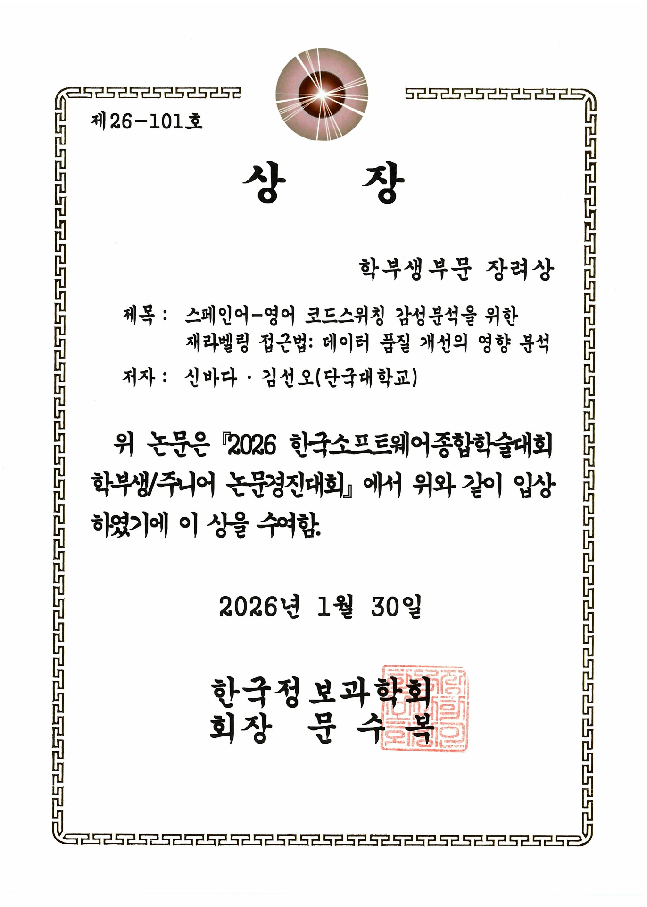

[English Version](README.md)

# Project PUENTE — 스페인어-영어 코드스위칭 감성분석을 위한 재라벨링 접근법

[](docs/paper.pdf)
[](https://www.python.org/)
[](LICENSE)

> **"스페인어-영어 코드스위칭 감성분석을 위한 재라벨링 접근법: 데이터 품질 개선의 영향 분석"**
> KSC 2025 (한국소프트웨어종합학술대회) · 학부생논문경진대회 장려상

*PUENTE*는 스페인어로 "다리(bridge)"를 뜻합니다 — 코드스위칭 분석을 통해 언어 간의 다리를 잇는다는 의미를 담았습니다.

<p align="center">
  
</p>

## 🔍 개요

스페인어-영어 코드스위칭 감성분석의 표준 벤치마크인 LINCE SA 데이터셋에는 라벨링 오류가 존재합니다. 분석 결과 **전체 샘플의 17%가 잘못된 라벨**로 표기되어 있었습니다. 히스패닉-아메리칸 문화적 맥락에서 읽었을 때 원래 라벨이 실제 감성과 다른 경우가 대부분이었습니다.

이 프로젝트는 **데이터 중심(Data-Centric) 접근법**을 채택합니다. 더 복잡한 모델을 설계하는 대신, 라벨을 직접 검토·수정해 5,567개 규모의 Refined Dataset을 구축했고, 데이터 품질 개선만으로도 시도한 모든 아키텍처 개선보다 더 큰 성능 향상을 달성했습니다.

**핵심 기여:**
- LINCE SA 벤치마크의 17% 라벨링 오류율 발견 및 문서화
- 인간 검증 라벨을 적용한 5,567개 Refined Dataset 구축 (763개 수정)
- 데이터 정제만으로 +4.0%p 정확도 향상 — 9번의 멀티태스크 학습 실험을 모두 상회
- mBERT + XLM-R Late Fusion 앙상블로 최종 67.15% 달성

## 📊 핵심 성과

| 단계 | 모델 | 정확도 | 향상폭 |
|---|---|---|---|
| 베이스라인 | mBERT (원본 라벨) | 56.6% | — |
| 데이터 중심 | mBERT (Refined Dataset) | 60.6% | +4.0%p |
| 최종 | Late Fusion 앙상블 | **67.15%** | **+10.55%p** |

## 🗂️ 데이터셋

원본 LINCE SA 데이터셋은 Hugging Face에서 제공합니다:
[`lince-benchmark/lince` / `sa_spaeng`](https://huggingface.co/datasets/lince-benchmark/lince)

원본 텍스트는 재배포하지 않으며, 대신 다음 두 가지를 공개합니다:

- **`data/label_mapping.json`** — 수정된 763개 라벨 (`{sample_id: {original, corrected}}` 형식)
- **`data/build_refined_dataset.py`** — Hugging Face 원본 + 라벨 매핑으로 Refined Dataset 재현

**Refined Dataset 생성 방법:**
```bash
cd data
python build_refined_dataset.py
# 출력: data/refined_dataset.json (5,567개 샘플)
```

**수정 기준:**
LINCE SA는 히스패닉-아메리칸 영어에 대한 명확한 문화적 가이드라인 없이 라벨링되었습니다. 음식, 가족, 음악 등 해당 문화권에서 긍정적 의미를 갖는 스페인어 표현들이 중립이나 부정으로 분류된 사례가 많았습니다. 일관된 문화적 기준을 적용해 이를 재라벨링했습니다.

## 🏗️ 아키텍처

최종 모델은 **Late Fusion** 방식으로 mBERT와 XLM-R을 결합합니다. 두 모델을 각각 독립적으로 학습한 후, 출력 확률 분포를 이어 붙여 소규모 MLP 메타모델에 입력합니다.

```
         Refined Dataset (5,567개 샘플)
        /                              \
   mBERT                           XLM-R
(bert-base-multilingual-cased)  (xlm-roberta-base)
   + 2계층 헤드                   + 2계층 헤드
   (768 → 256 → 3)               (768 → 256 → 3)
   lr = 5e-6                      lr = 3e-5
        \                              /
         로짓 결합 (6차원 벡터)
                      |
             MLP 메타러너 (6 → 6 → 3)
                      |
                최종 예측 결과
```

**핵심 설계 인사이트:** mBERT는 의도적으로 낮은 학습률(`5e-6`)을 사용합니다. 단독 성능은 낮아지지만, XLM-R과의 예측 다양성이 높아져 앙상블 성능이 개선됩니다. 실험 30에서 확인했듯, 두 모델을 각각 최적화하면 오히려 앙상블 성능이 하락합니다.

## 🔬 실험 여정

이 결과는 5개 단계에 걸친 **34번의 체계적 실험** 끝에 도달한 것입니다.
전체 실험 기록은 [`docs/experiment_log.md`](docs/experiment_log.md)에서 확인할 수 있습니다.

| 단계 | 실험 번호 | 방향성 | 결과 |
|---|---|---|---|
| 1단계 | 실험 1 | mBERT 베이스라인 | **56.6%** — 기준점 설정 |
| 2단계 | 실험 2–9, 15–19 | 멀티태스크 학습 (하드 공유 + 어댑터) | 전부 실패 — 부정적 전이 확인 |
| 3단계 | 실험 10, 20–28 | 강화된 단일 태스크 (2계층 헤드, 튜닝) | **61.49%** 최고점 — 미미한 향상 |
| 4단계 | 실험 11–14 | 데이터 중심 전환 — Refined Dataset | **60.6%** — 모든 MTL 실험 상회 |
| 5단계 | 실험 29–34 | Late Fusion 앙상블 | **67.15%** — 최종 결과 |

**핵심 교훈:** 모델 중심 접근법(9번의 멀티태스크 실험, 10번의 아키텍처/하이퍼파라미터 실험)을 모두 시도한 후 데이터 품질 개선으로 방향을 전환했을 때 가장 큰 성능 도약(+4.0%p)이 나타났습니다. 앙상블은 그 위에서 추가 향상을 이루었습니다.

## ⚡ 재현 방법

**요구 사항:** Python 3.10 이상, CUDA GPU 권장 (Google Colab Pro 환경에서 테스트)

```bash
# 1. 레포지토리 클론
git clone https://github.com/vamosbada/project-puente.git
cd project-puente

# 2. 의존성 설치
pip install -r requirements.txt

# 3. Refined Dataset 생성
cd data && python build_refined_dataset.py && cd ..

# 4. 노트북 실행
jupyter notebook notebooks/
```

**노트북 실행 순서:**
1. `01_baseline_mbert.ipynb` — 56.6% 베이스라인 (Hugging Face에서 직접 로드)
2. `02_refined_dataset_mbert.ipynb` — `data/refined_dataset.json` 필요
3. `03_late_fusion_ensemble.ipynb` — `data/refined_dataset.json` 필요

**예상 소요 시간 (T4 GPU 기준):**
- 노트북 01, 02: 각 30–40분
- 노트북 03: 90–120분 (두 모델 순차 학습)

## 📄 인용

```bibtex
@inproceedings{shin2025puente,
  title     = {스페인어-영어 코드스위칭 감성분석을 위한 재라벨링 접근법:
               데이터 품질 개선의 영향 분석},
  author    = {신바다 and 김선오},
  booktitle = {한국소프트웨어종합학술대회 (KSC 2025)},
  year      = {2025},
  note      = {학부생논문경진대회 장려상}
}
```

## 📜 라이선스

- **코드** — MIT License ([LICENSE](LICENSE) 참조)
- **데이터** — `data/label_mapping.json`의 라벨 수정본은 [CC BY 4.0](https://creativecommons.org/licenses/by/4.0/)으로 공개합니다. 원본 텍스트의 저작권은 LINCE 데이터셋 원저자에게 있으며, 사용 시 해당 라이선스를 확인하시기 바랍니다.

## 🙏 감사의 말

- 지도: 단국대학교 컴퓨터공학과 김선오 교수님
- 지원: 단국대학교 SW중심대학사업단

